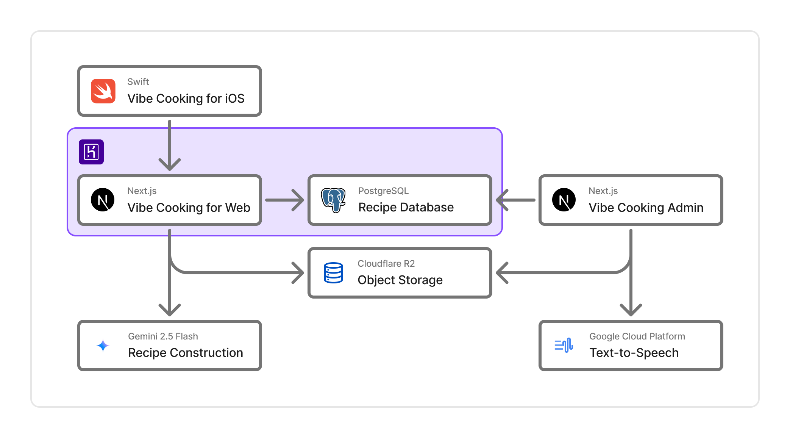

# VibeCooking

## Vibe Cooking とは

Vibe Cooking は、AI を活用したレシピ構築と音声コントロールにより、今までの料理体験の常識を覆します。

スマートフォンやタブレットでレシピを見ながら料理をするとき、以下のような悩みがあると考えました。

- 料理中に視線が画面と手元を行ったり来たりして面倒
- 手が濡れている時にスマホを触りたくない
- 複数の料理を調理するには、複数のレシピのページを行ったり来たりしないといけない

これらの問題を解決するために

- 音声でレシピを読み上げ
- ユーザが声でレシピを操作
- AI によって複数料理の最適手順の提案

という機能を実装しました。

### 関連リンク

- URL: https://vibe-cooking.app
- Web 版リポジトリ: https://github.com/furarico/vibe-cooking-web

## 技術スタック

### フレームワーク

- SwiftUI
- Swift Testing
- SFSpeechRecognizer
- AVFoundation

### ネットワーク・API

- OpenAPI Generator
- swift-openapi-runtime
- URLSession

### その他ツール

- Firebase

## システムアーキテクチャ

&copy; 2025 ギャ FUN!!
